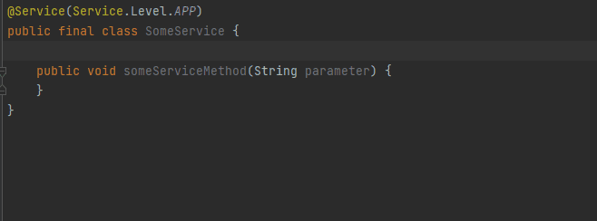
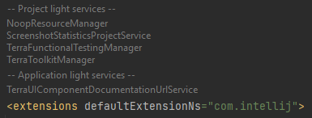

# Light Services

<!-- TOC -->
* [Generate Light Service static getInstance() method](#generate-light-service-static-getinstance-method)
* [Light Service conditions inspection](#light-service-conditions-inspection)
* [Light Services visualized in plugin.xml](#light-services-visualized-in-pluginxml)
* [Suspicious light service retrieval](#suspicious-light-service-retrieval)
<!-- TOC -->

Official Plugin SDK documentation: [Light Services](https://plugins.jetbrains.com/docs/intellij/plugin-services.html#light-services)

## Generate Light Service static getInstance() method

  [](../src/main/java/com/picimako/devkitplus/action/GenerateLightServiceStaticGetInstanceAction.java)

It is common practice, and is mentioned by the [Retrieving a Service](https://plugins.jetbrains.com/docs/intellij/plugin-services.html#retrieving-a-service)
section as well, that a static `getInstance()` convenience method may be added to light service classes to wrap service retrieval logic.

This action is available from the Alt+Insert **Generate** menu when the following conditions are met:
- the class is not anonymous
- the class is not an interface, an enum, or an abstract class
- the class is annotated as `com.intellij.openapi.components.Service`
- the class doesn't have any static `getInstance()` method defined

The generation logic happens as follows:
- If `Service.Level#PROJECT` is specified, then project-level getter is generated.
- If `Service.Level#APP` is specified, then application-level getter is generated.
- If no `Service.Level` is specified and the class name ends with
  - _ProjectService_, _ProjectSettings_, or _ProjectState_, then project-level getter is generated,
  - _ApplicationService_, _ApplicationSettings_ or _ApplicationState_, then application-level getter is generated.

In every other case, for now, a warning message is displayed that the service level could not be determined.
    
  <details>
      <summary><strong>Project-level example...</strong></summary>

  **From:**
  ```java
  @Service(Service.Level.PROJECT)
  public final class SomeService {
  }
  ```
  
  **To:**
  ```java
  @Service(Service.Level.PROJECT)
  public final class SomeService {
    public static SomeService getInstance(Project project) {
        return project.getService(SomeService.class);
    }
  }
  ```
  </details>

  <details>
      <summary><strong>Application-level example...</strong></summary>

  **From:**
  ```java
  @Service(Service.Level.APP)
  public final class SomeService {
  }
  ```
  
  **To:**
  ```java
  @Service(Service.Level.APP)
  public final class SomeService {
    public static SomeService getInstance() {
        return ApplicationManager.getApplication().getService(SomeService.class);
    }
  }
  ```
  </details>



## Light Service conditions inspection 

  [](../src/main/java/com/picimako/devkitplus/inspection/LightServiceClassConditionsInspection.java)

Although there are quite a lot of inspections built in to Plugin DevKit, this inspection aims to address some missing pieces in terms of
validating Light Service classes.

### Not final light services

One aspect, according to the [Light Services](https://plugins.jetbrains.com/docs/intellij/plugin-services.html#light-services) section
is that light service classes must be final.


### Light service is registered in plugin descriptor file

According to the Light Services documentation
> A service not going to be overridden does not need to be registered in plugin.xml (see Declaring a Service). Instead, annotate service class with @Service.

Thus, this inspection also reports light service classes that are registered in at least one of the plugin descriptor files
in the project, be it the main plugin.xml, or any of the descriptors of plugin dependencies.


Related DevKit inspections:
- `org.jetbrains.idea.devkit.inspections.NonDefaultConstructorInspection`

## Light Services visualized in plugin.xml

  [](../src/main/java/com/picimako/devkitplus/inlayhint/LightServicesInlayHintsProvider.kt)

According to the [Light Services](https://plugins.jetbrains.com/docs/intellij/plugin-services.html#light-services) Plugin SDK docs:
> A service not going to be overridden does not need to be registered in plugin.xml... Instead, annotate service class with @Service.

Thus, light services may or may not be visible in the plugin.xml unlike the rest of the plugin components.
This inlay hint aims to improve this situation by adding inlay hints to the starting tag of the `<extensions>` tag.

There are the following two display modes:

### List of light services

In this mode, it shows the names of light service classes in the project - grouped by the service level, and limited to a user-defined max number of items.

Upon clicking on a class name, it navigates to the corresponding class definition.



The number of displayed class items can be configured in <kbd>Settings</kbd> > <kbd>Editor</kbd> > <kbd>Inlay Hints</kbd> > <kbd>XML</kbd> > <kbd>Plugin light services</kbd>,
and allows a value between 1 and 50. Although displaying too many hints can be counter-productive, 50 as the max threshold provides enough flexibility for those who might need it
(and who might wanna feel like a badass).

Note: the settings values are stored on application-level based on IntelliJ's default behaviour.

If the number of light services in the project is greater than the max number of items to display, an additional *View all light services...* hint is also added.
Clicking on it, a popup list of all light service classes is displayed.


In this mode, hints are displayed for light service classes regardless of they are registered in `plugin.xml` or not.

(The examples are from one of my other plugins called *Terra Support*).

### View all

This mode shows only the *View all light services...* hint, which behaves the same as the hint with the same name in the previous display mode.


### Notes

As for the popup list (see [LightServicesHintPresentationAware](../src/main/java/com/picimako/devkitplus/inlayhint/LightServicesHintPresentationAware.kt)):
- there is no speed search implemented yet,
- the popup height is not yet limited to make the list scrollable

## Suspicious light service retrieval

  [](../src/main/java/com/picimako/devkitplus/inspection/LightServiceRetrievalInspection.java)

This inspection reports cases when a light service class that is also marked with one of the `Service.Level` types is being retrieved via a `ComponentManager`
(Project or Application) that doesn't match the service level specified in the class' `@Service` annotation.

Light services that are marked with both `Service.Level#PROJECT` and `Service.Level#APP` or neither of them, are excluded from the report.
`Module#getService()` calls are also excluded since there is no `Service.Level` enum constant for that, and module level services are no more recommended by JetBrains to be used.

**Project service via Application**


**Application service via Project**


