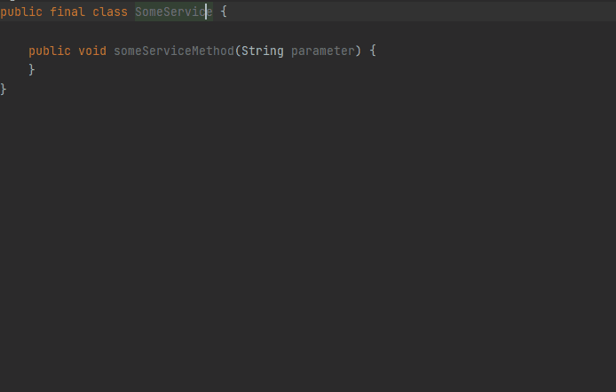
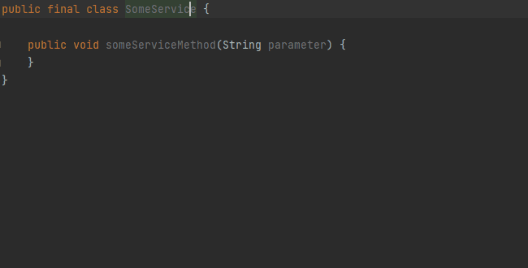

# PersistentStateComponents

Official Plugin SDK documentation: [Persisting State of Components](https://plugins.jetbrains.com/docs/intellij/persisting-state-of-components.html#top)

## Convert class to PersistentStateComponent

  [](../src/main/java/com/picimako/justkitting/intention/state/MakeClassPersistentStateComponentIntention.java)

According to the [Implementing the PersistentStateComponent Interface](https://plugins.jetbrains.com/docs/intellij/persisting-state-of-components.html#implementing-the-persistentstatecomponent-interface)
section there are two ways to specify the object that will store the state of the component, whose implementation this intention action helps with.

There are two child actions that can convert the target class to implement `PersistentStateComponent`, and generate a simple implementation of it by

1) using a separate inner class for storing the component state

    <details>
        <summary><strong>See example...</strong></summary>
    
    **From:**
    ```java
    public final class SomeService {
    }
    ```
    
    **To:**
    ```java
    @State(name = "SomeService", storages = @Storage("TODO: INSERT STORAGE NAME"))
    public final class SomeService implements PersistentStateComponent<SomeService.State> {
    
        private State myState = new State();
    
        @Override
        public State getState() {
            return myState;
        }
    
        @Override
        public void loadState(State state) {
            myState = state;
        }
    
        static final class State {
    
        }
    }
    ```
    </details>

2) using the component class itself for storing the state

    <details>
        <summary><strong>See example...</strong></summary>

   **From:**
    ```java
    public final class SomeService {
    }
    ```

   **To:**
    ```java
    @State(name = "SomeService", storages = @Storage("TODO: INSERT STORAGE NAME"))
    public final class SomeService implements PersistentStateComponent<SomeService> {
    
        @Override
        public SomeService getState() {
            return this;
        }
    
        @Override
        public void loadState(SomeService state) {
            XmlSerializerUtil.copyBean(state, this);
        }
    }
    ```
    </details>

| Separate state object                                                                                                              | Component class as state                                                                                                  |
|------------------------------------------------------------------------------------------------------------------------------------|---------------------------------------------------------------------------------------------------------------------------|
|  |  |

The generated code is based on the aforementioned SDK document section, and is available when the following conditions are met:
- the class is not an enum, an interface, or an abstract class
- the class doesn't already implement `PersistentStateComponent`
